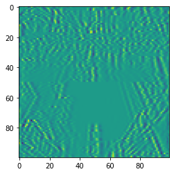
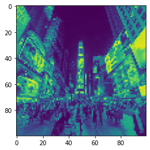

# Chapter 3. 파이토치로 구현하는 ANN
----
## 1) 텐서와 Autograd
### (1) 텐서(Tensor)란 무엇인가?
텐서란, 파이토치에서 다양한 수식을 계산하는 데 사용하는 가장 기본적인 자료구조이다.<br>
텐서에는 차원(랭크)라는 개념이 있다.<br>
- 랭크 0 : 스칼라
- 랭크 1 : 벡터
- 랭크 2 : 2차원 행렬
- 랭크 3 이상 : 3차원 이상 행렬

### 텐서 정의하기


```python
import torch
```


```python
# 0차원 텐서 = 스칼라
q = torch.tensor(1)
print(q)
```

    tensor(1)
    


```python
# 1차원 텐서 = 벡터
p = torch.tensor([1,2,3])
print(p)
```

    tensor([1, 2, 3])
    


```python
# 2차원 텐서 = 2차원 행렬
x = torch.tensor([[1,2,3],[4,5,6],[7,8,9]])
print(x)
```

    tensor([[1, 2, 3],
            [4, 5, 6],
            [7, 8, 9]])
    


```python
# 3차원 텐서 = 다차원 행렬
y = torch.tensor([[[1,2,3],[7,8,9]],[[1,2,3],[7,8,9]],[[1,2,3],[7,8,9]]]) # 각 열의 요소 수가 다르면 에러 발생
print(y)
```

    tensor([[[1, 2, 3],
             [7, 8, 9]],
    
            [[1, 2, 3],
             [7, 8, 9]],
    
            [[1, 2, 3],
             [7, 8, 9]]])
    

### 텐서 정보 확인, 수정하기
텐서 정보 확인
- t.size(), t.shape
- t.ndimension()


```python
def printTensor(t):
    print("Size: ", t.size())
    print("Shape: ", t.shape)
    print("Dimension: ", t.ndimension())
```


```python
printTensor(y)
```

    Size:  torch.Size([3, 2, 3])
    Shape:  torch.Size([3, 2, 3])
    Dimension:  3
    


```python
# torch.unsqueeze(tensor, index) : i번째 자리에 차원값 1을 추가한다. 따라서 해당 텐서는 차원이 1 증가한다.
modified_y = torch.unsqueeze(y, 0)
printTensor(modified_y)
```

    Size:  torch.Size([1, 3, 2, 3])
    Shape:  torch.Size([1, 3, 2, 3])
    Dimension:  4
    


```python
# torch.squeeze(tesnsor) : 크기가 1인 랭크를 삭제한다. 1인 랭크가 없으면 변화 없음.
modified_y = torch.squeeze(modified_y)
printTensor(modified_y)
```

    Size:  torch.Size([3, 2, 3])
    Shape:  torch.Size([3, 2, 3])
    Dimension:  3
    


```python
# tensor.view(n) : 랭크 1의(1차원 벡터) [n]모양으로 바꾸는 함수. 
print(x);
modified_x = x.view(9)
print(modified_x)
```

    tensor([[1, 2, 3],
            [4, 5, 6],
            [7, 8, 9]])
    tensor([1, 2, 3, 4, 5, 6, 7, 8, 9])
    


```python
# 이때, n은 반드시 요소의 개수와 일치해야 한다. 크거나 작으면 에러.
try:
    modified_x = x.view(2,4)
except Exception as e:
    print(e)
```

    shape '[2, 4]' is invalid for input of size 9
    

### 정리
텐서를 수정하는 함수들은 기존에 존재하던 요소를 건들이지 않으면서 텐서의 모양만 수정한다.<br>
따라서 기존 요소를 지우거나, 허용되지 않은 방법으로 요소를 늘린다면 에러가 발생한다.
- torch.squeeze(tensor, index) : i번째 자리에 크기가 1인 차원을 하나 추가한다.
- torch.unsqueeze(tensor) : 크기가 1인 차원을 삭제한다.
- tensor.view(num of element) : 다차원 행렬을 1차원 벡터로 변환한다. 파라미터는 반드시 요소의 개수와 일치해야 한다.

### (2) 텐서를 이용한 연산과 행렬곱
### 행렬곱
a, b라는 행렬로 행렬곱을 하려면 다음 조건이 성립해야 한다.
- a의 열 수와 b의 행 수는 같아야 한다.
- 행렬곱 a`*`b의 결과 행렬의 행 개수는 a, 열 개수는 b와 같다.

#### 행렬 정의하기
행렬w : 정규분포에서 무작위로 값을 뽑아 텐서를 생성하는 randn함수를 이용하여 5x3의 shape를 가진 텐서.<br>
행렬x : 실수형 원소들을 직접 넣어 3x2의 shape를 가진 텐서.
- torch.randn(a, b, dtype=torch.type) : a`*`b shape를 가진 type형 텐서를 랜덤하게 생성하는 함수.


```python
w  = torch.randn(5, 3, dtype=torch.float)
x = torch.tensor([[1.0, 2.0],[3.0, 4.0],[5.0, 6.0]])
print("w:",w)
print("x:",x)
```

    w: tensor([[-0.0900,  0.8526, -0.0104],
            [ 1.4684, -2.0092,  0.1427],
            [ 0.3965, -1.1503, -0.1248],
            [-1.9296, -1.2552,  0.5724],
            [ 1.4546, -0.5352, -0.3728]])
    x: tensor([[1., 2.],
            [3., 4.],
            [5., 6.]])
    


```python
print("w:",w)
```

    w: tensor([[ 0.2971, -0.7423,  1.0410],
            [ 0.3600,  0.9063, -0.3170],
            [-0.2004,  1.6428, -0.0296],
            [ 1.7403,  0.1789, -2.0311],
            [ 0.4068, -1.9636,  1.0907]])
    


```python
b = torch.randn(5, 2, dtype=torch.float)
printTensor(b)
print("b:", b)
```

    Size:  torch.Size([5, 2])
    Shape:  torch.Size([5, 2])
    Dimension:  2
    b: tensor([[-0.3968,  0.2361],
            [-0.3162, -0.1926],
            [ 0.1883, -1.6577],
            [-0.1288,  0.2252],
            [-0.0247, -0.0826]])
    

#### 연산 수행하기


```python
# torch.mm(a,b) : 행렬곱 함수
wx = torch.mm(w,x) #w[5,3], x[3,2] 따라서 행렬곱 조건을 만족한다.
print("wx size:", wx.size())
print("wx:", wx)
```

    wx size: torch.Size([5, 2])
    wx: tensor([[ 3.2752,  3.8710],
            [ 1.4941,  2.4435],
            [ 4.5798,  5.9925],
            [-7.8787, -7.9907],
            [-0.0302, -0.4963]])
    


```python
# a + b : 행렬 덧셈
result = wx + b
print("result size:", result.size())
print("result:", result)
```

    result size: torch.Size([5, 2])
    result: tensor([[ 2.8784,  4.1071],
            [ 1.1779,  2.2508],
            [ 4.7681,  4.3348],
            [-8.0075, -7.7655],
            [-0.0550, -0.5789]])
    

### (3) Autograd를 이용한 경사하강법
 - __distance__ : 데이터에 대한 정답(ground truth)과 머신러닝 모델이 예측한 결과의 차이를 산술적으로 표현한 것
 - __loss__ : 학습 데이터로 계산한 거리들의 평균
 loss가 작은 모델일수록 주어진 데이터에 대해 더 정확한 답을 낸다고 볼 수 있다.<br>
 이러한 loss를 최소화하는 데에 쓰이는 대표적인 알고리즘이 __경사하강법(gradient descent)__이다.
 - __gradient descent__ : loss 함수를 미분한 후 기울기가 최소가 되는 지점을 찾아내는 알고리즘
 
 즉, gradient descent 기법을 사용하기 위해선 미분이 필요한데, pytorch의 __Autograd__는 미분 계산을 자동화 하여 수고를 덜어준다.

tensor를 정의할 때 requires_grad 값을 True로 설정하면 파이토치의 Autograd 기능이 활성화 되며<br>
자동으로 w에 대한 미분값을 w.grad에 저장한다.


```python
w = torch.tensor(1.0, requires_grad=True)
```


```python
a = w*3
```


```python
l = a**2 # (w*3)^2 = 9*w^2
```


```python
#l을 w에 대해 미분
l.backward()
print('l을 w로 미분한 값은 {}'.format(w.grad))
```

    l을 w로 미분한 값은 18.0
    

## 2) 경사하강법으로 이미지 복원하기
### (1) 오염된 이미지 문제
이미지 처리를 위해 만들었던 weird_function() 함수에 실수로 버그가 들어갔고, 원본 이미지를 해당 함수에 투입시켜<br>
100x100 픽셀의 오염된 이미지가 만들어졌다. 원본 이미지는 삭제된 상태이며, weird_function() 함수의 소스코드는 남아있다.<br>

- 문제 해결 알고리즘(?)
1. weird_function()의 동작을 반대로 수행하는 복원 함수를 만든다.
2. 복원 함수에 오염된 이미지를 투입시켜 원본 이미지를 구한다.

위 알고리즘은 이론적으로는 정석이지만, 실제로는 매우 어렵다.따라서 머신러닝과 수학적 최적화에 더 가까운 방법을 사용해야 한다.

---
- __머신러닝을 활용한 문제 해결 알고리즘__
1. 오염된 이미지와 크기가 같은 __텐서 x__를 생성한다.
2. x를 weird_function()에 입력하여 오염된 이미지 __y__를 만들어낸다.
3. 만약 y가 오염된 이미지와 같다면, 오염된 이미지의 원본은 x와 같다.<br>
즉, __weird_function(x) = broken_image__ 관계가 성립해야 한다. 여기에 경사하강법을 이용하여<br> 
weird_function(x)과 broken_image와의 __오차가 최소가 되는 지점__을 구할 수 있으며,해당 지점이 원본 이미지이다.


```python
import torch
import pickle # 오염된 이미지 파일을 로딩하는 데 사용할 라이브러리
import matplotlib.pyplot as plt
```


```python
broken_image = torch.FloatTensor(pickle.load(open('./broken_image_t.p', 'rb'), encoding='latin1'))
plt.imshow(broken_image.view(100, 100))
```


    <matplotlib.image.AxesImage at 0x15fed55efd0>


    

    


```python
# 버그가 있는 함수
def weird_function(x, n_iter=5):
    h = x
    filt = torch.tensor([-1./3, 1./3, -1./3])
    for i in range(n_iter):
        zero_tensor = torch.tensor([1.0 * 0])
        h_l = torch.cat((zero_tensor, h[:-1]), 0)
        h_r = torch.cat((h[1:], zero_tensor), 0)
        h = filt[0] * h + filt[2] * h_l + filt[1] * h_r
        if i % 2 == 0:
            h = torch.cat((h[h.shape[0]//2:], h[:h.shape[0]//2]), 0)
    return h
```


```python
# weird_function(x) = y와 broken_image 사이의 loss를 구하는 함수
def distance_loss(y, broken_image):
    return torch.dist(y, broken_image)
```


```python
# 100 * 100 행렬이 1차원 벡터 모양으로 표현된 텐서
random_tensor = torch.randn(10000, dtype=torch.float)
```


```python
# learning rate : 경사하강법에서 한 이터레이션을 수행할 때 이동할 거리
lr = 0.8
```

경사하강법에서 learning rate가 너무 크면 최소점을 지나칠 수 있고, 너무 작으면 학습 속도가 느려진다.


```python
# 경사하강법 구현
for i in range(0, 20000):  # 경사하강법을 20000번 수행
    random_tensor.requires_grad_(True)
    y = weird_function(random_tensor) # random_tensor를 에러 함수에 집어넣어 생성한 '가설'
    loss = distance_loss(y, broken_image) # 가설과 정답의 loss를 계산
 
    # autograd 를 사용하여 역전파 단계를 계산한다. 
    # 이는 requires_grad=True를 갖는 모든 텐서들에 대한 손실의 변화도를 계산한다.
    loss.backward()
        
    # 파이토치의 자동 기울기 계산 비활성화
    with torch.no_grad():
        random_tensor = random_tensor - lr * random_tensor.grad 
        # loss가 최대가 되는 지점의 반대 방향으로 random_tensor를 lr만큼 이동시킨다.
    if i % 1000 == 0:
        print('Loss at {} = {}'. format(i, loss.item()))
```

    Loss at 0 = 12.25673770904541
    Loss at 1000 = 1.1336250305175781
    Loss at 2000 = 0.5327885150909424
    Loss at 3000 = 0.36475613713264465
    Loss at 4000 = 0.2856989800930023
    Loss at 5000 = 0.23746511340141296
    Loss at 6000 = 0.2034732550382614
    Loss at 7000 = 0.17689889669418335
    Loss at 8000 = 0.15449033677577972
    Loss at 9000 = 0.13460512459278107
    Loss at 10000 = 0.11635971814393997
    Loss at 11000 = 0.09924431890249252
    Loss at 12000 = 0.08294638991355896
    Loss at 13000 = 0.0672638788819313
    Loss at 14000 = 0.05206169933080673
    Loss at 15000 = 0.03724765405058861
    Loss at 16000 = 0.022760052233934402
    Loss at 17000 = 0.02116250805556774
    Loss at 18000 = 0.021166492253541946
    Loss at 19000 = 0.021167250350117683
    

이터레이션 단계가 증가하면서 loss가 점점 줄어드는 것을 알 수 있다.


```python
plt.imshow(random_tensor.view(100, 100).data)
```


    <matplotlib.image.AxesImage at 0x15fed5bceb0>


    

    


## 3) 신경망 모델 구현하기

